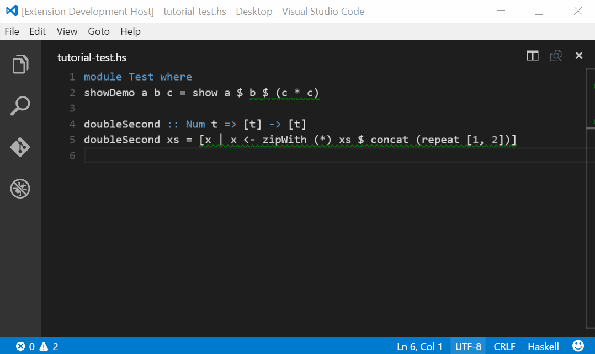

# README

## Changelog
__0.0.4__:
- Added `hlint.ignore` configuration (Thanks to @vigoo) 

__0.0.3__:
- Fixed bug where linting was always being performed on save
- Added option to disable linting
- Added configuration schema to `package.json` which helps users when changing preferences

__0.0.2__:
- Fixed configuration, setting `haskell.hlint.executablePath` should work
- Fixed code actions in response to [this VS Code issue](https://github.com/Microsoft/vscode/issues/1698)
- Made issues more readable
- Get information/choose from multiple suggestions
- Default linting is now onType
- Removed ignoreSeverity setting

## Overview
"haskell-linter" is a wrapper for [hlint](http://community.haskell.org/~ndm/hlint/). It highlights hlint warnings and errors inline and provides a code-action to accept hlint suggestions.

It expects hlint to be installed and already added to the path. If it is installed but cannot be found, add the path to your preferences as seen below.

```json
{
	"haskell.hlint.executablePath": "Path\To\Executable"
}
```



## Configuration:
There are various options that can be configured by making changes to your user or workspace preferences.

### Lint onType or onSave
By default the linter will lint as you type. Alternatively, set `haskell.hlint.run` to `onSave` or `never` if you want to lint only when the file is saved (works best if auto-save is on) or disable it for a workspace or entirely. 

```json
{
	"haskell.hlint.run": "onType" // also: "onSave", "never"
}
```

### Hints
By default the linter simply calls the `hlint` command without arguments. To specify a set of hints to use or a set of hints to ignore, add them to the configuration as shown below. 
 
```json
{
	"haskell.hlint.hints": ["Default", "Dollar", "Generalise"],
    "haskell.hlint.ignore": ["Redundant do"]
}
```

### Troubleshooting
If you're having issues with the extension, set the logLevel setting to `log` and check the output in the developer tools console.

```json
{
    "haskell.hlint.logLevel": "log"
}
```

## Acknowledgements
The extension architecture is based off of the PHPValidationProvider from the built-in [php extension](https://github.com/Microsoft/vscode/tree/master/extensions/php).
